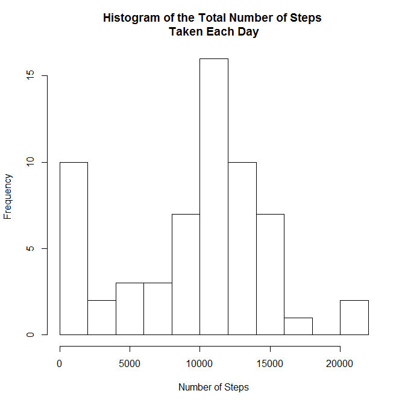
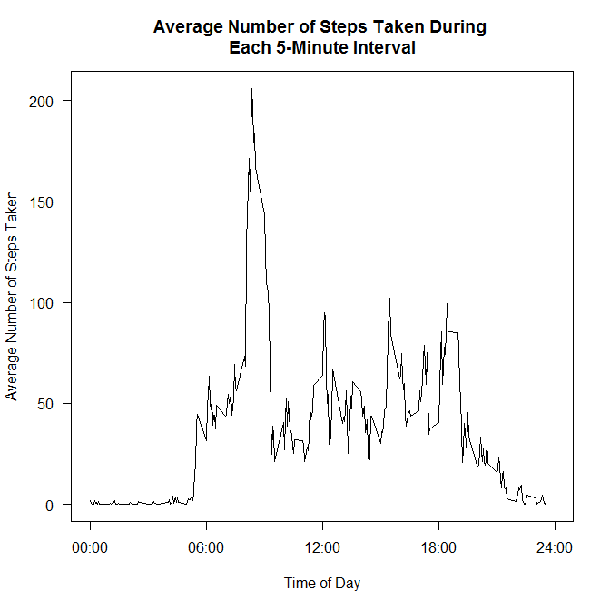
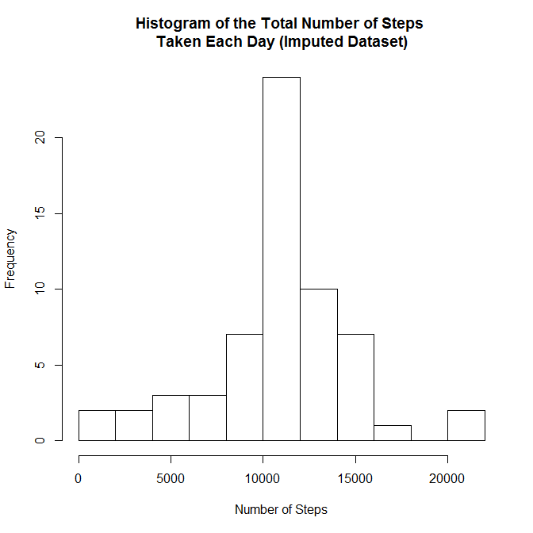
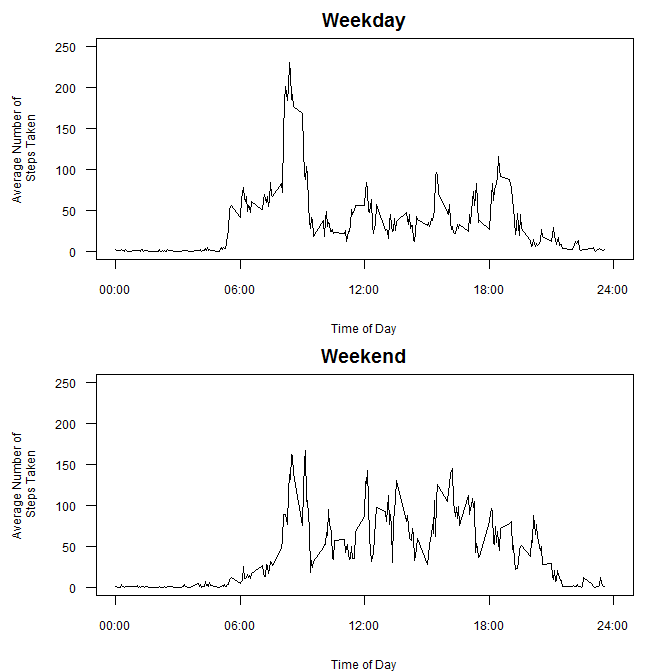

Reproducible Research: Peer Assessment 1
========================================

The purpose of this assignment is to perform a simple exploratory data analysis of data collected from a personal activity monitoring device and to use *Rmarkdown* and *knitr* to ensure the analysis is reproducible. The personal activity monitoring device records the amount of activity (i.e., "number of steps") conducted by an an individual in 5-minute intervals. The data were collected during a two month period between October and November 2012 and can be obtained by forking or cloning [this repository](http://github.com/rdpeng/RepData_PeerAssessment1) or downloading the data from [here](https://d396qusza40orc.cloudfront.net/repdata%2Fdata%2Factivity.zip).

For this analysis I am using [R 3.1.1](http://www.r-project.org/) and [RStudio 0.98.953](http://www.rstudio.com/products/RStudio/).

#### Version Information

```r
version
```

```
##                _                           
## platform       x86_64-w64-mingw32          
## arch           x86_64                      
## os             mingw32                     
## system         x86_64, mingw32             
## status                                     
## major          3                           
## minor          1.1                         
## year           2014                        
## month          07                          
## day            10                          
## svn rev        66115                       
## language       R                           
## version.string R version 3.1.1 (2014-07-10)
## nickname       Sock it to Me
```

### Loading Required Libraries and Loading and Preprocessing the Data

For this analysis I will use the "data.table" and the "ggplot2" packages. 


```r
# These commands check whether a package has been installed and loads it. If the package has not been installed, it is downloaded,
# installed, and loaded.
if(!require("data.table")) install.packages("data.table", repos = "http://cran.r-project.org") 
```

```
## Loading required package: data.table
```

```r
library(data.table)
if(!require("ggplot2")) install.packages("ggplot2", repos = "http://cran.r-project.org")
```

```
## Loading required package: ggplot2
```

```r
library(ggplot2)
```

After forking [this repository](http://github.com/rdpeng/RepData_PeerAssessment1) and cloning it to my machine, I created directories for the data and figures using the commands below.


```r
dir <- "./data" # data directory
if (!file.exists(dir)) {dir.create(dir)} # creates a data directory in your working directory if one doesn't already exist
fig <- "./figures" # figure directory
if (!file.exists(fig)) {dir.create(fig)} # creates a figure directory in your working directory if one doesn't already exist
```

Once the necessary directories have been created, the data are unzipped from the "activity.zip" file to "activity.csv" in the data directory. After unzipping the data, it is read into R using "fread" from the data.table package and dates are converted from character strings to a date format. By examining the data in the interval column, it is apparent that these data are the times at which the data were collected (i.e., 5 corresponds to 00:05, 2330 corresponds to 23:30, etc.). By examining the steps column, it is readily apparent that there are missing data within the dataset.  


```r
## Checks whether the data has been unzipped to your data directory and if not, unzips it and saves it in the data directory
if (!("activity.csv" %in% list.files(dir))) {
  unzip("activity.zip", exdir = "data") # unzips the file(s) to the data directory
}

## Reads the data into a data.table
activity <- fread(paste0(dir, "/activity.csv"))

## Determine the structure of the loaded data and look at data
str(activity) 
```

```
## Classes 'data.table' and 'data.frame':	17568 obs. of  3 variables:
##  $ steps   : int  NA NA NA NA NA NA NA NA NA NA ...
##  $ date    : chr  "2012-10-01" "2012-10-01" "2012-10-01" "2012-10-01" ...
##  $ interval: int  0 5 10 15 20 25 30 35 40 45 ...
##  - attr(*, ".internal.selfref")=<externalptr>
```

```r
## Converts the character date column to an IDate column
activity$date <- as.IDate(activity$date) # IDate is a specific date class used by the data.table package
```

## What is the Mean Total Number of Steps Taken per Day?

For the first section of this analysis, I am interested in learning what is the average total number of steps taken per day during the two month period and what sort of distribution does the average of the total number of steps taken per day have and are their any outliers or bunching of the data which might lead me to believe that the average may not be the best way to summarize the dataset? To address the latter question, the plot below is a histogram of the total number of steps taken each day.


```r
## Calculate the total number of steps taken each day and plot a histogram of this data
hist(activity[, list(num_steps = sum(steps, na.rm = TRUE)), by = date][, num_steps], 
     breaks = 10,
     xlab = "Number of Steps", 
     main = "Histogram of the Total Number of Steps \nTaken Each Day")
```

 

The total number of steps taken each day appears to follow an approximately normal distribution except for the relatively elevated number of days in which relatively few steps (i.e., less than 2500) were taken. As a result, as a first approximation the mean and median could potentially be used to summarize the total number of steps taken each day; these summaries are calculated using the code below.


```r
# Calculate the mean and median of the total number of steps taken each day
mmsteps <- activity[, list(num_steps = sum(steps, na.rm = TRUE)), 
                    by = date][, list(mean_steps = mean(num_steps, na.rm = TRUE),
                                      median_steps = median(num_steps, na.rm = TRUE))]
```

The mean and median total number of steps taken per day are 9354.2295 and 10395, respectively.

## What is the Average Daily Activity Pattern?

For the second part of this analysis, I wanted to know whether there were patterns to the anonymous individual's daily activities. To evaluate this, the plot below is a time series of the average number of steps taken during each time period across the entire dataset (i.e., across all days of the dataset). 


```r
## Calculate the average number of steps taken each 5-minute time period (across all days) and plot these data as a time series
plot(activity[, list(avg_steps = mean(steps, na.rm = TRUE)), by = interval], 
     type = "l",
     xlim = c(0, 2400),
     xaxt = "n",
     las = 1,
     xlab = "Time of Day", 
     ylab = "Average Number of Steps Taken",
     main = "Average Number of Steps Taken During \nEach 5-Minute Interval")
axis(1, at = seq(0, 2400, by = 600), labels = c("00:00", "06:00", "12:00", "18:00", "24:00"))
```

 

As seen in the plot above, across the entire dataset, a large spike in activity is observed sometime around 8 AM. 


```r
## Determines which interval, on average, contains the maximum average number of steps and converts the result to a time format.
max_activity <- activity[, list(avg_steps = mean(steps, na.rm = TRUE)), by = interval][, .SD[which.max(avg_steps)]]
time <- strptime(sprintf("%04d", max_activity$interval), format = "%H%M")
```

The time of day (i.e., 5-minute interval) that contained the maximun average number of steps is 835 or 08:35.

## Imputing Missing Values

As observed when originally examining the data, the steps column of the activity dataset contains missing data. 


```r
## Calculates the number of missing data within the steps column of the activity dataset
sum(is.na(activity$steps))
```

```
## [1] 2304
```

Summary statistics on the steps column indicate that there are 2304 missing data within the dataset. As this missing data may introduce bias into calculations such as the mean of the total number of steps taken, data for the missing values were imputed using the average number of steps taken during a particular time period over the length of the dataset (i.e., the average number of steps taken each 5-minute time period across all days).


```r
## Imputes values for the missing data using the average of total number of steps taken during a particular time interval
activity_imp <- activity[, steps_imp := ifelse(is.na(steps), mean(steps, na.rm = TRUE), steps), by = interval]
```

To examine the effect imputing missing data has on the dataset, the analyses performed in the first section of this analysis (i.e., "What is the Mean Total Number of Steps Taken per Day?") are reproduced below using the imputed dataset.


```r
## Calculate the total number of steps taken each day and plot a histogram of this data
hist(activity_imp[, list(num_steps = sum(steps_imp, na.rm = TRUE)), by = date][, num_steps], 
     breaks = 10,
     xlab = "Number of Steps", 
     main = "Histogram of the Total Number of Steps \nTaken Each Day (Imputed Dataset)")
```

 

After having imputed data for the missing values, the distribution of the total number of steps taken each day appears to be approximately normal and there is no longer the relatively high frequency of days during which fewer than 2500 steps were taken as was observed in the original dataset.


```r
# Calculate the mean and median of the total number of steps taken each day
mmsteps_imp <- activity[, list(num_steps = sum(steps_imp, na.rm = TRUE)), 
                    by = date][, list(mean_steps = mean(num_steps, na.rm = TRUE),
                                      median_steps = median(num_steps, na.rm = TRUE))]
```

Prior to imputing values for the missing data, the mean and median were 9354.2295 and 10395, respectively; after imputing values for the missing data, the mean and median are 1.0766 &times; 10<sup>4</sup> and 1.0766 &times; 10<sup>4</sup>, respectively.

As can be seen above, by imputing data for the missing values, the mean total number of steps each day increases as does the median total number of steps each day. Interestingly, after imputing the data, the median total number of steps each day is exactly the same as the mean total number of steps each day. 

## Are there Differences in Activity Patterns Between Weekdays and Weekends?

As observed in the time series plot of steps taken each day, there was a sharp rise in the number of steps taken at 08:35. To assess whether this increase was a result of a factor like commuting to work or school, I classified each day within the dataset as being either a "weekday" or a "weekend" and then prepared time series plots of the average number of steps (using the imputed dataset) taken during each time period across the entire dataset (i.e., across all days of the dataset) for each of these categories. This plot is presented below.


```r
activity[, weekday := ifelse(weekdays(date) %in% c("Saturday", "Sunday"), "Weekend", "Weekday")]
```

```
##        steps       date interval steps_imp weekday
##     1:    NA 2012-10-01        0   1.71698 Weekday
##     2:    NA 2012-10-01        5   0.33962 Weekday
##     3:    NA 2012-10-01       10   0.13208 Weekday
##     4:    NA 2012-10-01       15   0.15094 Weekday
##     5:    NA 2012-10-01       20   0.07547 Weekday
##    ---                                            
## 17564:    NA 2012-11-30     2335   4.69811 Weekday
## 17565:    NA 2012-11-30     2340   3.30189 Weekday
## 17566:    NA 2012-11-30     2345   0.64151 Weekday
## 17567:    NA 2012-11-30     2350   0.22642 Weekday
## 17568:    NA 2012-11-30     2355   1.07547 Weekday
```

```r
setkey(activity, weekday)

par(mfrow = c(2,1), mar = c(4, 5, 2, 2))
  plot(activity[J("Weekday"), list(avg_steps = mean(steps_imp, na.rm = TRUE)), by = interval], 
       type = "l",
       xlim = c(0, 2400),
       ylim = c(0, 250),
       xaxt = "n",
       las = 1,
       cex.lab = 0.75, 
       cex.axis = 0.75,
       xlab = "Time of Day", 
       ylab = "Average Number of \nSteps Taken",
       main = "Weekday")
  axis(1, at = seq(0, 2400, by = 600), labels = c("00:00", "06:00", "12:00", "18:00", "24:00"), cex.axis = 0.75)

  plot(activity[J("Weekend"), list(avg_steps = mean(steps_imp, na.rm = TRUE)), by = interval], 
       type = "l",
       xlim = c(0, 2400),
       ylim = c(0, 250),
       xaxt = "n",
       las = 1,
       cex.lab = 0.75, 
       cex.axis = 0.75,
       xlab = "Time of Day", 
       ylab = "Average Number of \nSteps Taken",
       main = "Weekend")
  axis(1, at = seq(0, 2400, by = 600), labels = c("00:00", "06:00", "12:00", "18:00", "24:00"), cex.axis = 0.75)
```

 

Indeed, the spike in activity (i.e., the number of steps taken) around 08:35 is greater on weekdays than on weekends. Throughout the remainder of the day however, it appears that the individual wearing the activity monitor tends to take a greater number of steps throughout the remainder of the day during the weekend (i.e., the individual is more active between around 09:00 and 21:00 on the weekend than during weekdays).
